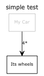
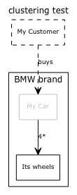

# dot-diagram
A simple Java wrapper on top of Graphviz dot tool. It offers two basic layers of functionalities.

# API on top of the Dot Syntax

This project provides a convenient API (DotGraph) to create graphs, including sub-graphs (clusters), that are then rendered into .dot syntax text.

For example:

~~~~~~~~
    final DotGraph graph = new DotGraph("simple test");
		final Digraph digraph = graph.getDigraph();
		digraph.addNode("Car").setLabel("My Car").setComment("This is BMW").setOptions(STUB_NODE_OPTIONS);
		digraph.addNode("Wheel").setLabel("Its wheels").setComment("The wheels of my car");
		digraph.addAssociation("Car", "Wheel").setLabel("4*").setComment("There are 4 wheels")
				.setOptions(ASSOCIATION_EDGE_STYLE);
~~~~~~~~

Would generate the dot syntax:

~~~~~~~~
# Class diagram simple test
digraph G {
	graph [labelloc=top,label="simple test",fontname="Verdana",fontsize=12];
	edge [fontname="Verdana",fontsize=9,labelfontname="Verdana",labelfontsize=9];
	node [fontname="Verdana",fontsize=9,shape=record];
//This is BMW
	c0 [label="My Car", color=grey,fontcolor=grey,fontname="Verdana",fontsize=9]
//The wheels of my car
	c1 [label="Its wheels"]
	// There are 4 wheels
	c0 -> c1 [label="4*"  , arrowhead=open];
}
~~~~~~~~

# Convenience on top of the Graphviz tool
This project also offers for convenience a DotWriter that launches Graphviz to render the dot file into an image file. This requires Graphviz to be installed on the machine, along with read/write access to the disk for temporary .dot files.

For example, calling dot on the simple graph above would generate this image:

And the clustering example would generate this image:

Please look at the tests for more examples.

# See
http://www.graphviz.org
